(Private source code)

<div align="center">

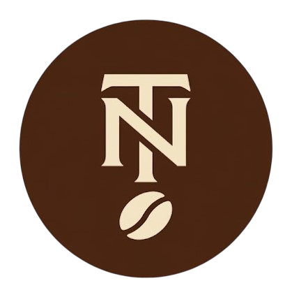

# TN1983 Coffee Operations Platform

**Coffee Operations Platform for a Family-Owned Roasting Business**

</div>
<p align="center">


</p>

## Table of Contents

- [Overview](#overview)
- [Business Problem](#1-business-problem)
- [Key Features](#2-key-features)
  - [Public Website](#public-website)
  - [Administration Dashboard](#administration-dashboard)
- [Order Workflow](#3-order-workflow)
- [System Architecture](#4-system-architecture)
- [Technical Highlights](#5-technical-highlights)
- [Engineering Decisions](#6-engineering-decisions)
- [Tech Stack](#7-tech-stack)
- [Screenshots](#8-screenshots)
- [Future Enhancements](#9-future-enhancements)
- [Author](#author)

## Overview

TN1983 Coffee Operations Platform is a business management platform developed for a family-owned coffee roasting business in Buon Ma Thuot, Vietnam.

The system centralizes customer, product, and order management while supporting the business's day-to-day operational workflow, from order reception to fulfillment. It also provides a public-facing website for product information and order tracking.

Project was built to solve operational challenges and is currently deployed and used in production for managing actual customer and order data.

### Project Status: Production (MVP)

The current version covers the core business workflow required for daily operations, including customer management, product management, order processing, revenue monitoring, and customer order tracking.
### Actors

- **Business owner/Administrator:** Manages customers, products, orders, and business operations.
- **Customer:** Views product information and tracks order status.
---

## 1. Business Problem

TN1983 is a family-owned coffee roasting business that primarily receives orders through phone calls, messaging applications, and direct purchases.

Before the system was introduced, customer information and order progress were tracked manually. As order volume increased, it became more difficult to maintain a clear view of customer history, production status, and business performance.

The business needed a centralized platform to:

- Store customer and order information in one place
- Track orders throughout the roasting and fulfillment process
- Reduce reliance on manual records
- Provide visibility into daily business operations
- Allow customers to check order status without direct contact

The goal of this project was to digitize the core operational workflow while keeping the system simple enough for everyday use in a small business environment.

---

## 2. Key Features

### Public Website

| Feature | Description |
|----------|-------------|
| Product Catalog | Display available coffee products, packaging options, and pricing information. |
| Business Information | Introduce the business, coffee roasting process, and contact details. |
| Order Tracking | Allow customers to check the current status of their orders. |

### Administration Dashboard

| Feature | Description |
|----------|-------------|
| Authentication & Authorization | Secure access using role-based authentication. |
| Customer Management | Create, update, search, and manage customer information. |
| Product Management | Manage products, pricing, and availability. |
| Order Management | Create orders and manage the complete order lifecycle. |
| Order Status Tracking | Track orders from reception to completion. |
| Revenue Dashboard | Monitor revenue and operational statistics. |

---

## 3. Order Workflow

The business workflow was modeled directly from the actual roasting and packaging process.

```text
RECEIVED
    ↓
ROASTING
    ↓
PACKAGING
    ↓
WAITING_FOR_SHIPPING
    ↓
SHIPPED
    ↓
COMPLETED
```

This workflow allows both business owners and customers to understand the current order state at any time.

---

## 4. System Architecture

The platform consists of two frontend applications, a centralized backend API, and a managed PostgreSQL database.

### Deployment Overview

- Public Website deployed on Vercel
- Admin Dashboard deployed on Vercel
- Backend API deployed on Azure Virtual Machine
- PostgreSQL hosted on Neon
- Cloudflare used for DNS management, TLS/SSL, and traffic protection

### Architecture Diagram

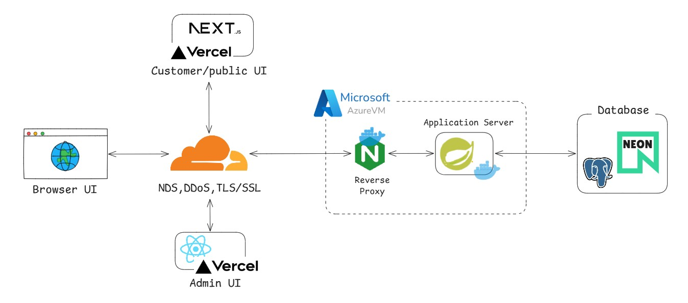

---

## 5. Technical Highlights

| Area | Implementation |
|--------|----------------|
| Authentication & Authorization | JWT-based authentication with role-based access control (RBAC). |
| API Design | Standardized REST API responses, request validation, and centralized exception handling. |
| Order Workflow Management | Business-driven order lifecycle from order reception to fulfillment. |
| Dashboard & Reporting | Revenue statistics, order monitoring, and operational insights. |
| Security | Password hashing, access control, API rate limiting, and Cloudflare protection. |
| Database Design | Relational data model with support for customer, product, and order management. |
| CI/CD | Automated build and deployment pipelines using GitHub Actions. |
| Production Deployment | Public-facing deployment using Vercel, Azure VM, Neon PostgreSQL, and Cloudflare. |

---

## 6. Engineering Decisions

### Why Modular Monolith Instead of Microservices?

The application currently serves a single business domain and is maintained by a single developer.

A modular monolith provides:

* Clear module boundaries
* Lower operational complexity
* Easier deployment
* Simpler debugging

while preserving a migration path toward microservices if future requirements demand it.

---

### Why Next.js For The Public Website?

The public website is customer-facing and benefits from:

* Better SEO
* Faster initial page loads
* Improved search engine discoverability

---

### Why React For The Admin Dashboard?

Administrative screens require:

* Dynamic forms
* Complex data tables
* Interactive management workflows

React provides a productive environment for building highly interactive internal tools.

---

### Why Cloudflare?

Cloudflare provides:

* DNS management
* TLS/SSL termination
* Basic DDoS mitigation
* Edge caching

allowing the application server to remain focused on business logic.

---

### Why Neon PostgreSQL?

The system requires a managed PostgreSQL solution that minimizes infrastructure maintenance while remaining cost-effective for a small business environment.

Neon was selected because it provides:

* Fully managed PostgreSQL
* Automatic backups and maintenance
* Separation of compute and storage
* Lower operational overhead compared to self-hosting a database
* A generous free tier suitable for the current workload

This allows development effort to focus on business features and system reliability rather than database administration.

---

## 7. Tech Stack

| Layer | Technologies |
|---------|-------------|
| Backend | Java, Spring Boot|
| Database | Neon PostgreSQL|
| Public Website | Next.js, TypeScript, Tailwind CSS |
| Admin Dashboard | React, TypeScript, Tailwind CSS, TanStack Query, Zustand |
| Infrastructure | Docker, Nginx, Azure VM, Vercel, Cloudflare |
| CI/CD | GitHub Actions |

---

## 8. Screenshots

### Public Website

**Screenshot 1 — Home Page Hero Section**

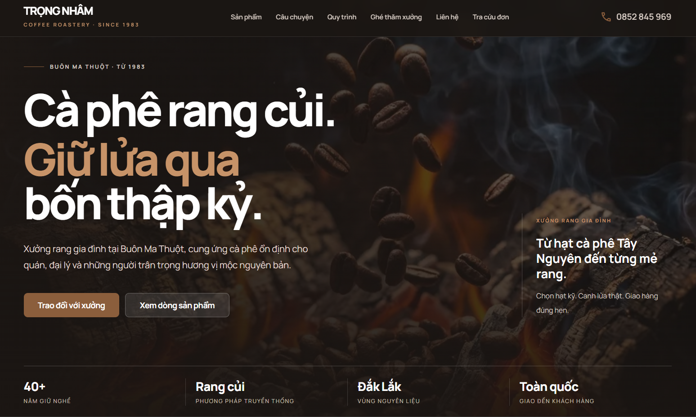

**Screenshot 2 — Products Section**

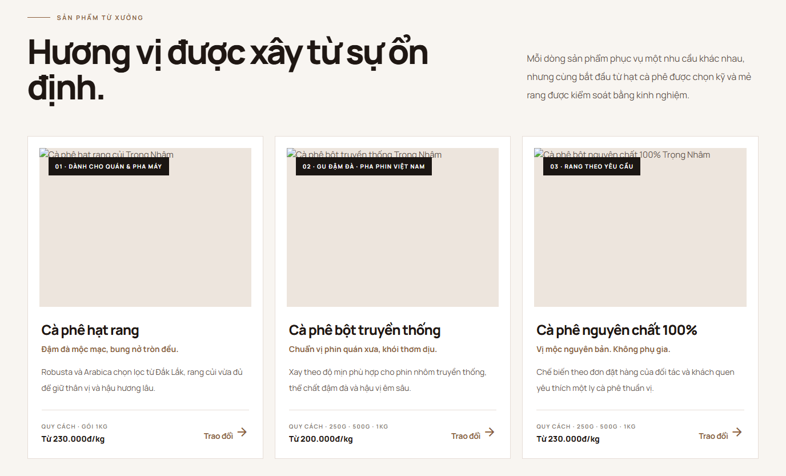

**Screenshot 3 — Order Tracking Section (Customer site)**

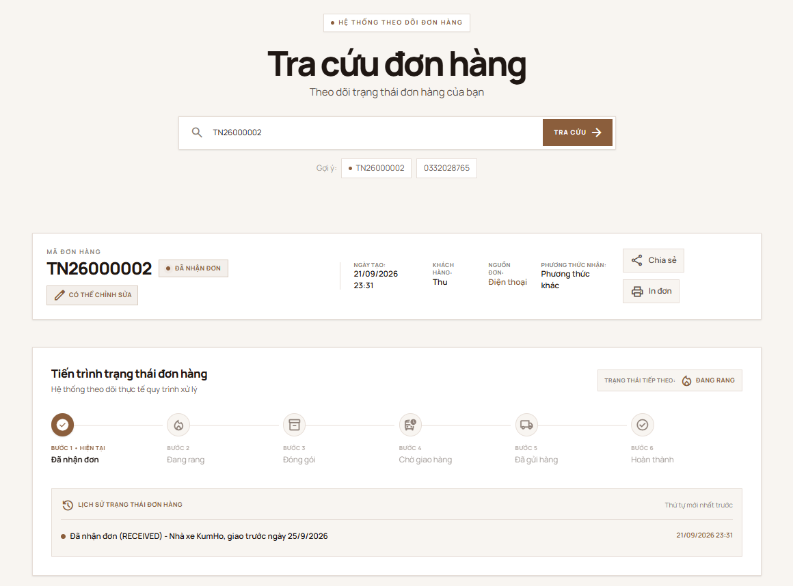
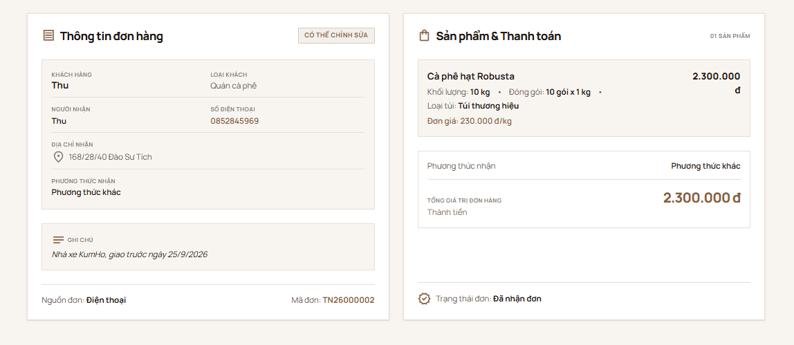

---

### Admin Dashboard

**Screenshot 4 — Dashboard Overview Screen**

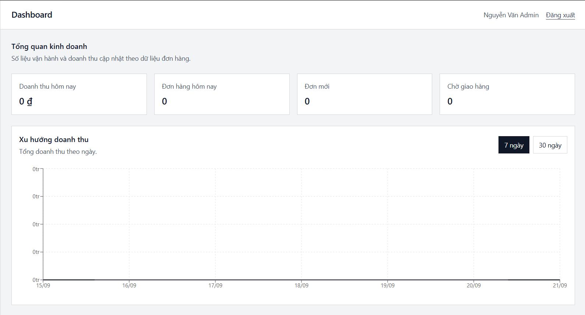
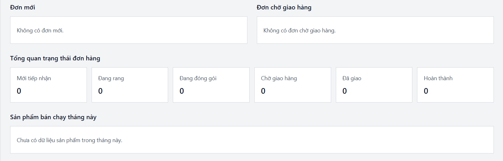

**Screenshot 5 — Order Management Screen**

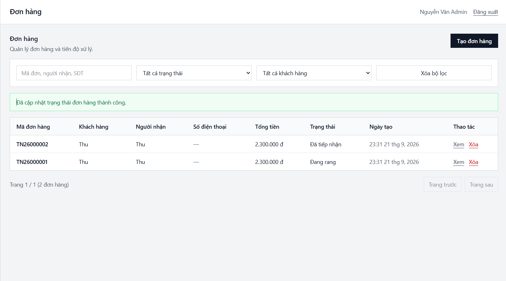

**Screenshot 6 — Order Detail Screen**

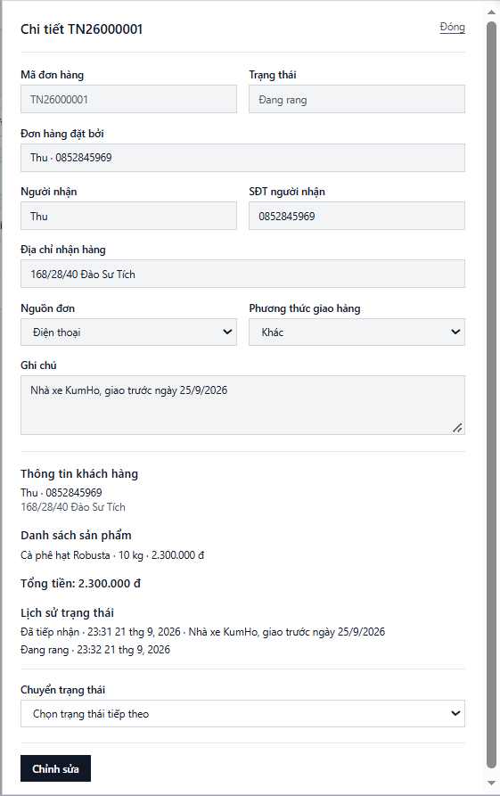

**Screenshot 8 — User Management Screen**

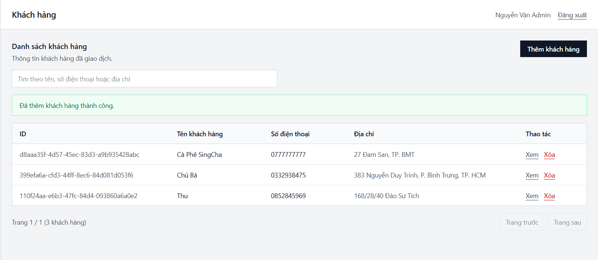
---

## 9. Future Enhancements

The current MVP focuses on core order management and daily business operations. Planned enhancements include:

- **Customer Notifications**  
  Notify customers about order status changes through SMS or messaging platforms to reduce manual follow-up communication.

- **Inventory Management**  
  Track raw materials, finished products, and stock movements to support production planning and inventory control.

- **Financial Management**  
  Record operational expenses and revenue to provide better visibility into business profitability and cash flow.

- **Advanced Reporting & Analytics**  
  Extend the current dashboard with detailed business reports, trend analysis, product performance metrics, and operational insights.

- **Customer Accounts & Order History**  
  Allow customers to access previous orders and track purchasing history.

- **Multi-User Administration**  
  Support multiple administrative users with role-based permissions and activity tracking.

---

## Author

### Nguyen Tien Dat

**Java Backend Developer | Computer Science Student**  
Ho Chi Minh City Open University

#### Project Role

Sole developer responsible for designing, building, deploying, and maintaining the TN1983 Coffee Operations Platform.

---
